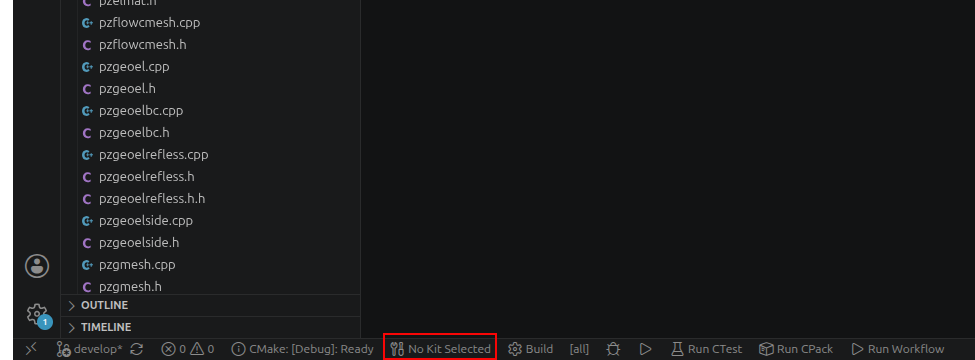
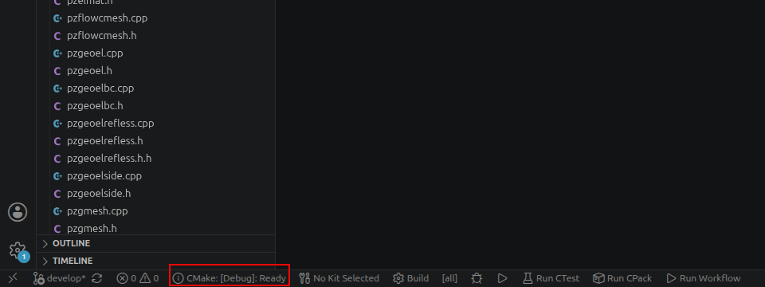
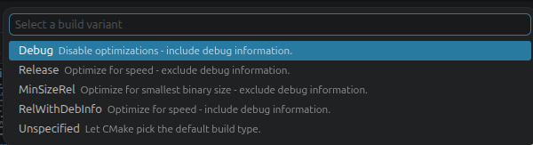
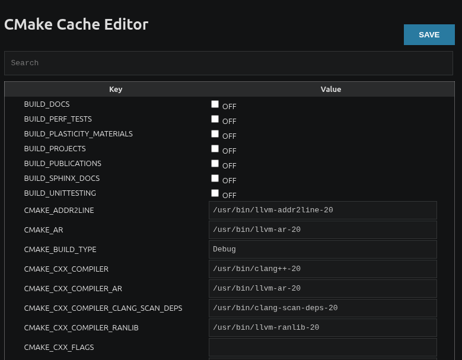
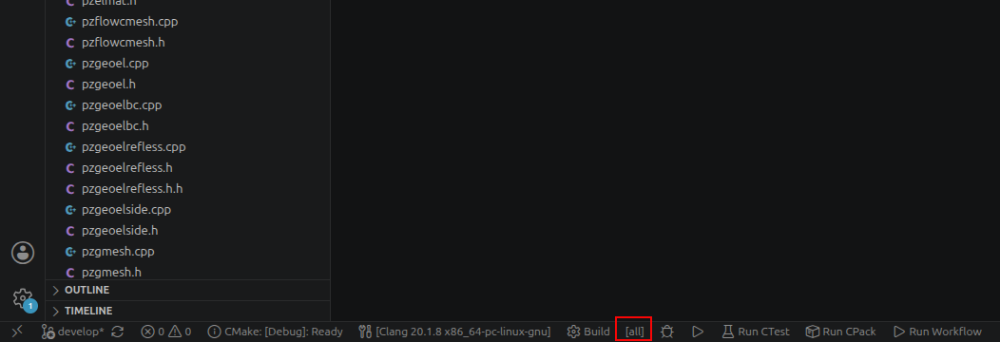
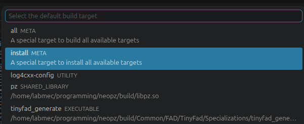
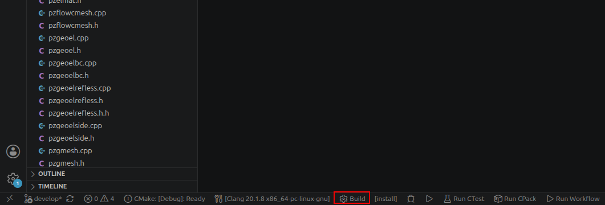
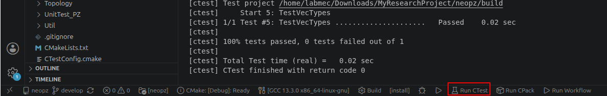

# NeoPZ Installation Guide

This guide explains how to build, test, and install NeoPZ on Linux, macOS, and Windows through WSL2.

It also shows how to compile and run an example project using NeoPZ and how to enable optional libraries such as MKL/Pardiso and MUMPS.

## Contents

* [1. Prerequisites](#1-prerequisites)
* [2. Quick start — Linux](#2-quick-start--linux)
* [3. Quick start — macOS](#3-quick-start--macos)
* [4. Windows through WSL2](#4-quick-start--windows-via-wsl2)
* [5. Running the unit tests](#5-running-the-unit-tests)
* [6. Running your first project](#6-running-your-first-project-neopzexamples)
* [7. Alternative interface: VS Code CMake Tools](#7-alternative-interface-vs-code-cmake-tools)
  * [7.1 Installing the required extensions](#71-installing-the-required-extensions)
  * [7.2 Preparing the project directory and creating a workspace](#72-preparing-the-project-directory-and-creating-a-workspace)
  * [7.3 Configuring and installing NeoPZ](#73-configuring-and-installing-neopz)
  * [7.4 Running the unit tests](#74-running-the-unit-tests)
  * [7.5 Configuring the project that uses NeoPZ](#75-configuring-the-project-that-uses-neopz)
* [8. Optional libraries and solvers](#8-optional-libraries-and-solvers)
  * [8.1 Configuring optional features](#81-configuring-optional-features)
  * [8.2 Blaze](#82-blaze)
  * [8.3 Boost](#83-boost)
  * [8.4 LAPACK](#84-lapack)
  * [8.5 Apache log4cxx](#85-apache-log4cxx)
  * [8.6 METIS](#86-metis)
  * [8.7 MKL and Pardiso](#87-mkl-and-pardiso)
  * [8.8 MUMPS](#88-mumps)

---

## 1. Prerequisites

Before installing NeoPZ, make sure your system has:

* **Git**
* **CMake 3.14 or newer**
* **A C++17 compiler**
* **A build tool**, such as Make or Ninja

You can check the installed versions with:

```sh
git --version
cmake --version
c++ --version
```

If any command is unavailable, follow the instructions for your operating system in the next sections.

Optional libraries and solvers, such as MKL/Pardiso, MUMPS, METIS and LAPACK, are covered separately after the basic installation.

---

## 2. Quick start — Linux

Install the required tools:

```sh
sudo apt-get update
sudo apt-get install -y build-essential cmake git
```

The steps below clone, configure, build, and install NeoPZ from the terminal. To do all of this through Visual Studio Code instead, skip to [Section 7](#7-alternative-interface-vs-code-cmake-tools).

Clone NeoPZ and switch to the `develop` branch:

```sh
mkdir -p MyResearchProject
cd MyResearchProject

git clone https://github.com/labmec/neopz.git
cd neopz
git checkout develop
```

Configure, build and install:

```sh
cmake -S . -B build \
  -DCMAKE_BUILD_TYPE=Debug \
  -DCMAKE_INSTALL_PREFIX="../neopz_install"

cmake --build build --parallel
cmake --install build
```

NeoPZ will be installed in:

```text
MyResearchProject/neopz_install
```

If `CMAKE_INSTALL_PREFIX` is not specified, NeoPZ is installed in `/opt/neopz`, which usually requires administrator permissions.

Before running an external project, follow [Section 5](#5-running-the-unit-tests) to verify the NeoPZ build.

---

## 3. Quick start — macOS

Install the Xcode command-line tools:

```sh
xcode-select --install
```

Check whether Homebrew is available:

```sh
brew --version
```

If the command is not found, install [Homebrew](https://brew.sh/). Then install the required tools:

```sh
brew install cmake git
```

The steps below clone, configure, build, and install NeoPZ from the terminal. To do all of this through Visual Studio Code instead, skip to [Section 7](#7-alternative-interface-vs-code-cmake-tools).

Clone NeoPZ and switch to the `develop` branch:

```sh
mkdir -p MyResearchProject
cd MyResearchProject

git clone https://github.com/labmec/neopz.git
cd neopz
git checkout develop
```

Configure, build and install:

```sh
cmake -S . -B build \
  -DCMAKE_BUILD_TYPE=Debug \
  -DCMAKE_INSTALL_PREFIX="../neopz_install"

cmake --build build --parallel
cmake --install build
```

NeoPZ will be installed in:

```text
MyResearchProject/neopz_install
```

If `CMAKE_INSTALL_PREFIX` is not specified, NeoPZ is installed in `/opt/neopz`, which usually requires administrator permissions.

Before running an external project, follow [Section 5](#5-running-the-unit-tests) to verify the NeoPZ build.

---

## 4. Quick start — Windows (via WSL2)

NeoPZ is not currently tested on native Windows. The recommended option is to use **WSL2 with Ubuntu** and then follow the Linux instructions.

1. Open **PowerShell as administrator** and run:

   ```powershell
   wsl --install
   ```

2. Restart the computer.

3. Open Ubuntu and create a Linux username and password.

4. Confirm that Ubuntu is using WSL2:

   ```powershell
   wsl --list --verbose
   ```

   The `VERSION` column should show `2`.

5. Open the Ubuntu terminal and follow
   [Section 2 — Quick start: Linux](#2-quick-start--linux).

Run all `git`, `cmake`, build and test commands inside Ubuntu, not in PowerShell.

For better performance, keep the project inside the Linux filesystem, such as:

```sh
mkdir -p ~/MyResearchProject
cd ~/MyResearchProject
```

Avoid building inside `/mnt/c/Users/...`.

For VS Code, install the **WSL** extension, open the project folder in Ubuntu
and run:

```sh
code .
```

---

## 5. Running the unit tests

NeoPZ uses unit tests to verify that the library was compiled correctly on your system.

The commands below run the tests from the terminal. To do this through Visual Studio Code instead, continue with [Section 7.4](#74-running-the-unit-tests).

From the `neopz` folder, enable the tests and rebuild:

```sh
cmake -S . -B build -DBUILD_UNITTESTING=ON
cmake --build build --parallel
```

Run all tests with:

```sh
ctest --test-dir build -C Debug --output-on-failure
```

A successful execution finishes with a message similar to:

```text
100% tests passed, 0 tests failed
```

The first configuration may download Catch2 automatically, so an internet connection is required.

If your CMake version does not support `--test-dir`, run:

```sh
cd build
ctest -C Debug --output-on-failure
cd ..
```

---

## 6. Running your first project (NeoPZExamples)

The [NeoPZExamples](https://github.com/labmec/NeoPZExamples) repository contains example projects that use an installed NeoPZ library.

Open a terminal in the `MyResearchProject` directory, which should contain:

```text
MyResearchProject/
├── neopz/
└── neopz_install/
```

Clone the examples repository:

```sh
git clone https://github.com/labmec/NeoPZExamples.git
```

The commands below configure and build NeoPZExamples from the terminal. To use Visual Studio Code instead, continue with [Section 7.5](#75-configuring-the-project-that-uses-neopz).

Configure the project using the NeoPZ installation created previously:

```sh
cmake -S NeoPZExamples -B NeoPZExamples/build \
  -DCMAKE_PREFIX_PATH="$(pwd)/neopz_install"
```

Build the `Poisson2D` example:

```sh
cmake --build NeoPZExamples/build \
  --target Poisson2D \
  --parallel
```

Run the executable:

```sh
./NeoPZExamples/build/Tutorial/Poisson2D/Poisson2D
```

A successful execution prints the approximation errors and creates the following files in the `MyResearchProject` directory:

```text
postprocess.txt
poissonSolution.vtk
```

The `poissonSolution.vtk` file can be opened with [ParaView](https://www.paraview.org/).

---

## 7. Alternative interface: VS Code CMake Tools

Visual Studio Code can be used to configure, build, install, test, and run NeoPZ through the CMake Tools extension.

This section provides an alternative to the terminal commands presented in Sections 2, 3, 5, and 6.

### 7.1 Installing the required extensions

Open Visual Studio Code and select the **Extensions** icon in the left sidebar.
Alternatively, press `Ctrl+Shift+X` on Linux or Windows, or `Cmd+Shift+X` on
macOS.

Search for and install the following extensions, both published by Microsoft:

1. **C/C++**
2. **CMake Tools**

If you are using Windows through WSL2, also install the **WSL** extension. Open the project in a WSL window and install **C/C++** and **CMake Tools** in the WSL environment when prompted.

The extensions do not install CMake or a C++ compiler. Make sure the tools from
[Section 1](#1-prerequisites) are already available.

### 7.2 Preparing the project directory and creating a workspace

Before opening the workspace, clone NeoPZ and the project that will use it.

The example below uses `NeoPZExamples`:

```sh
mkdir -p MyResearchProject
cd MyResearchProject

git clone https://github.com/labmec/neopz.git
git -C neopz checkout develop

git clone https://github.com/labmec/NeoPZExamples.git
```

For another project, replace `NeoPZExamples` with its repository or existing source directory.

The directory should now have the following structure:

```text
MyResearchProject/
├── neopz/
└── NeoPZExamples/
```

Create a `neopz_install` folder inside `MyResearchProject` — this is where NeoPZ will be installed.

1. In Visual Studio Code, select **File > Open Folder...** and open the project
   that will use NeoPZ:

   ```text
   MyResearchProject/NeoPZExamples
   ```

2. Select **File > Add Folder to Workspace...** and add the NeoPZ source
   folder:

   ```text
   MyResearchProject/neopz
   ```

3. Select **File > Save Workspace As...** and save the workspace inside
   `MyResearchProject`. For example:

   ```text
   MyResearchProject/MyResearchProject.code-workspace
   ```

The project and NeoPZ folders should now appear together in the Explorer panel.

### 7.3 Configuring and installing NeoPZ

4. Click any source file inside the `neopz` folder to make NeoPZ the active
   CMake project.

5. When prompted, select the C++ compiler installed on your system. You can
   also select the compiler using the CMake Tools status bar:

   

   If the compiler selection does not appear automatically, open the Command
   Palette with `Ctrl+Shift+P` on Linux or Windows, or `Cmd+Shift+P` on
   macOS, and select:

   ```text
   CMake: Select a Kit
   ```

6. Select **Debug** as the build variant using the CMake Tools controls in the bottom status bar.

   

   

   Alternatively, open the Command Palette and select:

   ```text
   CMake: Select Variant
   ```

7. Open the integrated terminal with **Terminal > New Terminal**, navigate to
   `MyResearchProject`, and run the following command to obtain its absolute
   path — you'll need it in the next step:

   ```sh
   pwd
   ```

8. Open the Command Palette and select:

   ```text
   CMake: Edit CMake Cache (UI)
   ```

   The NeoPZ configuration options will be displayed in the CMake cache editor:

   

9. Set `CMAKE_INSTALL_PREFIX` to the absolute path of a `neopz_install`
   directory inside `MyResearchProject`. For example:

   ```text
   /home/user/MyResearchProject/neopz_install
   ```

10. Enable the optional libraries required by your project, as described in [Section 8](#8-optional-libraries-and-solvers). The corresponding libraries must be installed before their `USING_*` options are enabled.

11. To compile the NeoPZ unit tests, also set:

    ```text
    BUILD_UNITTESTING=ON
    ```

12. Click **Save** to apply the configuration.

13. In the CMake Tools status bar, click the current build target, usually
    displayed as `[all]`. In the target list, expand **META** and select:

    ```text
    install
    ```

    

    

    The selected target should now be displayed as `[install]`.

14. Click **Build** in the CMake Tools status bar.

    

NeoPZ will be compiled and installed in the directory defined by
`CMAKE_INSTALL_PREFIX`:

```text
MyResearchProject/neopz_install
```

### 7.4 Running the unit tests

If `BUILD_UNITTESTING` was set to `ON`, build the `[all]` target first:

15. Click the current target `[install]` in the CMake Tools status bar.

16. Select the `[all]` target and click **Build**.

17. After the build finishes, click **Run CTest** in the CMake Tools status bar:

    

The tests can also be executed from the integrated terminal as described in [Section 5](#5-running-the-unit-tests).

### 7.5 Configuring the project that uses NeoPZ

18. Click any source file inside `NeoPZExamples` (or your own project's folder) to make it the active CMake project.

19. Select the compiler and the **Debug** build variant if prompted. The first automatic configuration may report that `NeoPZConfig.cmake` could not be found. The following steps indicate where the installed NeoPZ package is located.

20. Open the Command Palette and select:

    ```text
    CMake: Edit CMake Cache (UI)
    ```

21. Set `NeoPZ_DIR` to the directory containing `NeoPZConfig.cmake`. To locate the configuration file, open the integrated terminal and run:

    ```sh
    find /absolute/path/to/MyResearchProject/neopz_install \
      -name "NeoPZConfig.cmake"
    ```

    The command should return a path similar to:

    ```text
    /home/user/MyResearchProject/neopz_install/lib/cmake/neopz/NeoPZConfig.cmake
    ```

    In this example, set `NeoPZ_DIR` to the directory containing the file:

    ```text
    /home/user/MyResearchProject/neopz_install/lib/cmake/neopz
    ```

    Do not include `NeoPZConfig.cmake` in the value of `NeoPZ_DIR`.

22. Click **Save** to apply the configuration.

23. Select the executable target for your project in the CMake Tools status bar and click **Build**.

24. After the build finishes, use the **Run** or **Debug** button in the status bar to execute the selected target.

---

## 8. Optional libraries and solvers

NeoPZ supports several optional libraries and solvers. This section covers Blaze, Boost, LAPACK, log4cxx, METIS, MKL/Pardiso, and MUMPS.

### 8.1 Configuring optional features

Install the corresponding dependency before enabling a `USING_*` option.

The instructions in the following subsections first show how to install each dependency and then show the CMake option used to enable it from the terminal.

Lines such as:

```sh
-DUSING_METIS=ON
```

are not standalone shell commands. They must be added to the command that
configures NeoPZ. For example:

```sh
cmake -S neopz -B neopz/build-metis \
  -DCMAKE_BUILD_TYPE=Debug \
  -DUSING_METIS=ON \
  -DCMAKE_INSTALL_PREFIX="$PWD/neopz_install-metis"
```

Then build and install that configuration:

```sh
cmake --build neopz/build-metis --parallel
cmake --install neopz/build-metis
```

To enable the same options through Visual Studio Code, install the required dependency and follow [Section 7.3](#73-configuring-and-installing-neopz), Steps 7–14. In the CMake cache editor, change the corresponding `USING_*` option from `OFF` to `ON`, click **Save**, select the `install` target, and click **Build**.

Use separate build and installation directories when maintaining multiple
NeoPZ configurations. For example:

```text
MyResearchProject/
├── neopz/
│   ├── build/
│   ├── build-mkl/
│   └── build-metis/
├── neopz_install/
├── neopz_install-mkl/
└── neopz_install-metis/
```

### 8.2 Blaze

Blaze is a high-performance C++ library for dense and sparse linear algebra. NeoPZ uses it in components related to the Scaled Boundary Finite Element Method.

**CMake option:** `USING_BLAZE`

**Prerequisite:** Blaze requires `USING_MKL` or `USING_LAPACK` to already be enabled in the same configuration. Enable `USING_LAPACK` (see [8.4](#84-lapack)) alongside `USING_BLAZE` if you're not also using MKL.

#### Linux

Install Blaze from its official repository:

```sh
git clone https://bitbucket.org/blaze-lib/blaze.git

cmake -S blaze -B blaze/build \
  -DCMAKE_INSTALL_PREFIX="$PWD/blaze-install"

cmake --build blaze/build --parallel
cmake --install blaze/build
```

When configuring NeoPZ, include the installation directory and enable LAPACK:

```sh
-DUSING_BLAZE=ON \
-DUSING_LAPACK=ON \
-DCMAKE_PREFIX_PATH="$PWD/blaze-install"
```

#### macOS

Install Blaze with Homebrew:

```sh
brew install blaze
```

Enable it with (LAPACK comes for free here via Accelerate, see [8.4](#84-lapack)):

```sh
-DUSING_BLAZE=ON \
-DUSING_LAPACK=ON
```

### 8.3 Boost

NeoPZ uses Boost Graph, Boost Date-Time, and other Boost components in some specialized and experimental features.

**CMake option:** `USING_BOOST`

#### Linux

```sh
sudo apt-get install -y libboost-all-dev
```

#### macOS

```sh
brew install boost
```

Enable Boost with:

```sh
-DUSING_BOOST=ON
```

### 8.4 LAPACK

LAPACK provides routines for dense and banded linear algebra, including eigenvalue computations. When enabled, NeoPZ may use BLAS and LAPACK routines instead of its internal implementations.

**CMake option:** `USING_LAPACK`

#### Linux

```sh
sudo apt-get install -y libblas-dev liblapack-dev
```

Enable LAPACK with:

```sh
-DUSING_LAPACK=ON
```

#### macOS

A separate LAPACK installation is normally not required. NeoPZ can use the Accelerate framework provided by macOS.

Enable it with:

```sh
-DUSING_LAPACK=ON
```

Enabling `USING_MKL` also enables LAPACK support.

### 8.5 Apache log4cxx

Apache log4cxx provides logging and diagnostic messages. It is useful while developing or debugging NeoPZ and NeoPZ-based applications.

**CMake option:** `USING_LOG4CXX`

#### Linux

```sh
sudo apt-get install -y liblog4cxx-dev
```

#### macOS

```sh
brew install log4cxx
```

Enable log4cxx with:

```sh
-DUSING_LOG4CXX=ON
```

### 8.6 METIS

METIS provides graph partitioning, finite element mesh partitioning, and fill-reducing matrix ordering algorithms.

**CMake option:** `USING_METIS`

#### Linux

```sh
sudo apt-get install -y libmetis-dev
```

#### macOS

```sh
brew install metis
```

Enable METIS with:

```sh
-DUSING_METIS=ON
```

### 8.7 MKL and Pardiso

Intel oneAPI Math Kernel Library provides optimized BLAS and LAPACK routines. It also includes the Pardiso sparse direct solver.

**CMake option:** `USING_MKL`

Install Intel oneAPI following the [official Intel installation instructions](https://www.intel.com/content/www/us/en/docs/oneapi/installation-guide-linux/current/overview.html).

Load the Intel oneAPI environment before configuring NeoPZ:

```sh
source /opt/intel/oneapi/setvars.sh
```

Configure NeoPZ:

```sh
cmake -S neopz -B neopz/build-mkl \
  -DCMAKE_BUILD_TYPE=Debug \
  -DBUILD_UNITTESTING=ON \
  -DUSING_MKL=ON \
  -DCMAKE_INSTALL_PREFIX="$PWD/neopz_install-mkl"
```

Build, test, and install:

```sh
cmake --build neopz/build-mkl --parallel

ctest --test-dir neopz/build-mkl \
  -C Debug \
  --output-on-failure

cmake --install neopz/build-mkl
```

Enabling `USING_MKL` also enables LAPACK support.

### 8.8 MUMPS

MUMPS is a sparse direct solver for large linear systems. It supports sequential and parallel numerical factorization methods.

**CMake option:** `USING_MUMPS`

NeoPZ uses the MUMPS package available at [giavancini/mumps](https://github.com/giavancini/mumps).

#### Linux prerequisites

```sh
sudo apt-get install -y gfortran libblas-dev liblapack-dev libopenblas-dev libmetis-dev
```

#### macOS prerequisites

```sh
brew install gcc openblas metis libomp
```

Install MUMPS by following the instructions in its repository. After the installation, configure NeoPZ with:

```sh
cmake -S neopz -B neopz/build-mumps \
  -DCMAKE_BUILD_TYPE=Debug \
  -DBUILD_UNITTESTING=ON \
  -DUSING_MUMPS=ON \
  -DMUMPS_ROOT="/absolute/path/to/mumps-install" \
  -DCMAKE_INSTALL_PREFIX="$PWD/neopz_install-mumps"
```

Build, test, and install:

```sh
cmake --build neopz/build-mumps --parallel

ctest --test-dir neopz/build-mumps \
  -C Debug \
  --output-on-failure

cmake --install neopz/build-mumps
```

`MUMPS_ROOT` must point to the MUMPS installation directory, not to its source directory.

---

Still stuck after following the steps above? Contact <neopz@googlegroups.com> or open a [GitHub issue](https://github.com/labmec/neopz/issues).
